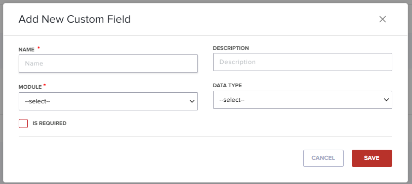

# Procedures

Aside from explanatory content, you'll be writing procedures. Procedures aren't background material. That is,
a user doesn't need a reason to use a procedure. They're often looking for the *how* in a situation. 
Here are some rules of thumb for writing effective procedures:

* Each action is a numbered step. Results **do not** take a number as they are not a step.
* If there is only one step, use a bullet, and not the number 1.
* Active voice is easier to understand. Use it!
* Use second person. You're talking to the user, so second person is best. You can even use the word *You* in your instructions (like I just did).
* Present tense. Most of the time users read the instructions when they're in the middle of trying to do something or to solve a problem.
* No more than 8 steps. If you require more, break the procedure up into a grouped set.
* Include images and videos if they help the user. Even a schematic drawing can help when showing how to install hardware.
* Use sub-steps sparingly, and use bullets or a, b, c, etc. Don't mix them!

Also, don't use *Input* to show typing, or another way of entering
information. Use *Type* or *Paste* or the actual action verb instead. Because there are now multiple ways to use 
software, such as a laptop, tablet, or other mobile device, we've had to deal with *Tap*, "*Click*, *Press*, and so on.  

Here is a procedure 
------------------------------------------------

#### To add a new custom field:

1.	On the **Subscriptions** screen, select **Custom Fields**.  

2.	Click **Add Custom Field**. 
3.	Fill out the **Add New Custom Field** dialog box. 

4.	Give the field a unique **Name** and **Description**.
5.	In the **Module** drop-down, choose **Customer** or **Transaction**.
6.	In the **Data Type** drop-down, choose a type. 
7.	(Optional) Select the **Is Required** checkbox if the field must be filled out.
8.	Click **Save** to add the field.
