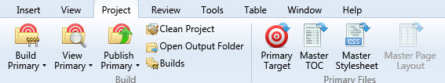

# Creating good screenshots

Screenshots are essential
for almost any documentation as they can help users by
providing a quick visual cue. Nobody wants to read or write a lot of
text. Why spend so much time describing a process that can fit in a
couple of screenshots?

You have to think about many things when making screenshots, such as
image size, image quality, information privacy, text readability, and
more.

## Ground rules
Figure out precisely *what* you are doing the screenshots for, and this
will allow you to capture just the details you need. Take some time to
make sure that no UI element will be left outside the frame if it is of
importance. Remember, a user should understand where the element in
question is in the UI to be able to find it. On this screenshot,
it's impossible to understand what tab is open without going through
some explanatory text.

Instead, put it in context. You can see the commands, but where is it?
As you see below, the user can see it is part of the
**Project** group.

Thinking through helps a lot, especially when doing a series of
screenshots to depict some steps. A mistake at the very beginning can
ruin the flow for a user, plan it before you start. Create the
environment thoroughly before taking any action, be mindful of any
pitfalls, and give the users a heads-up when necessary.
